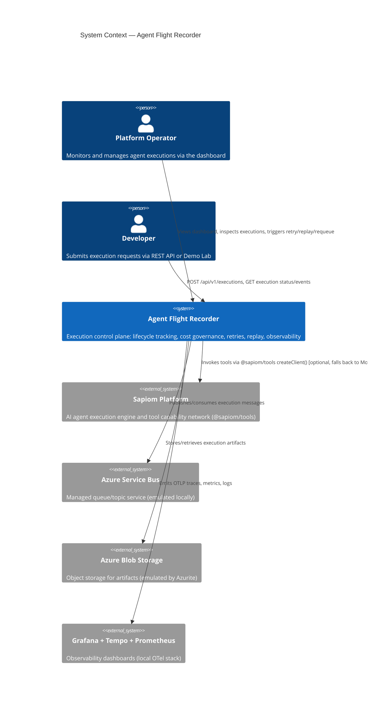
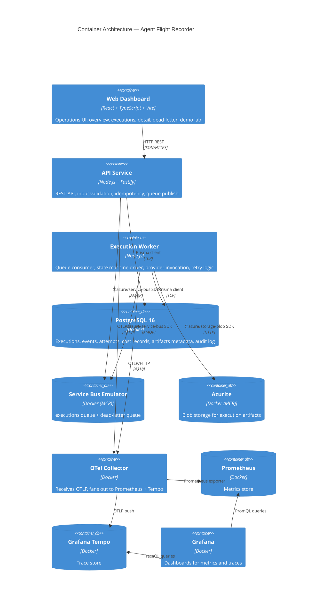
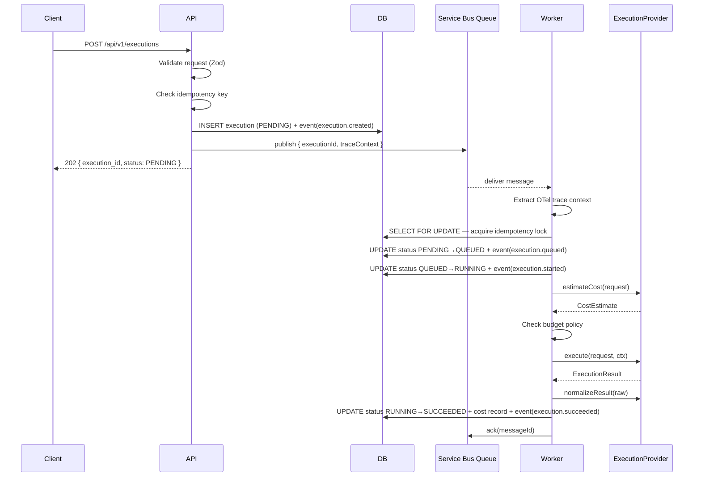
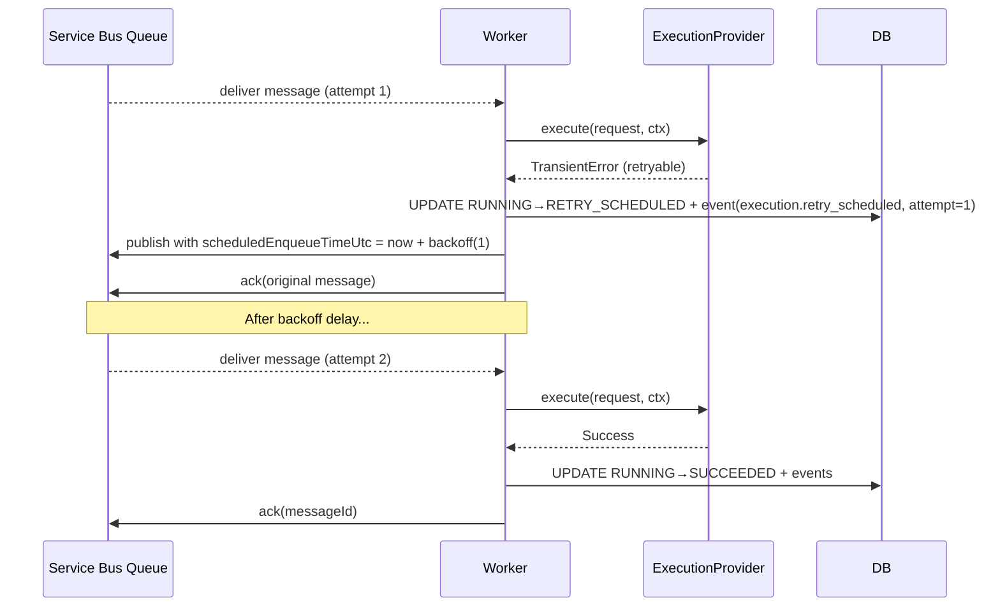
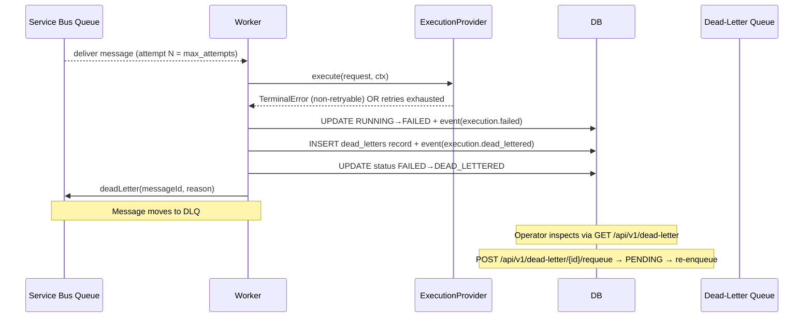
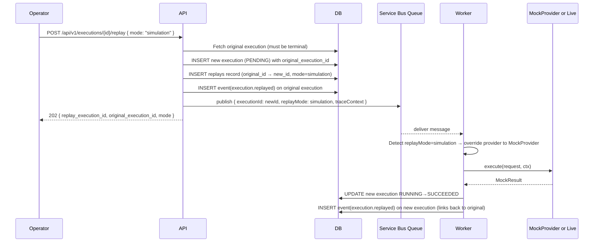
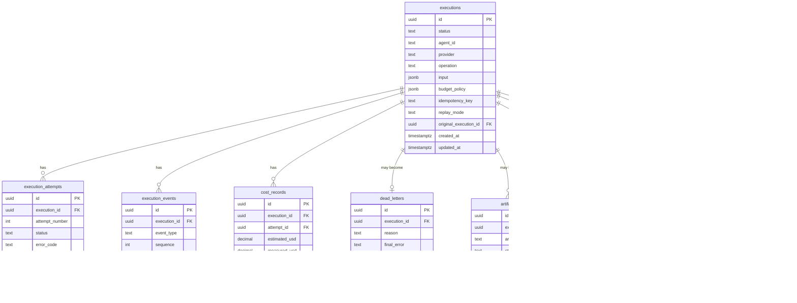
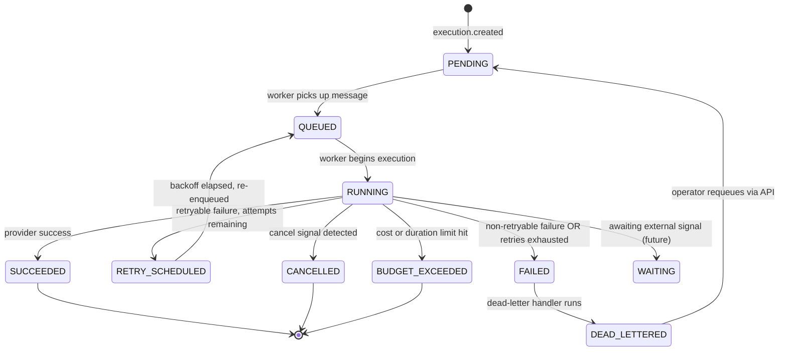
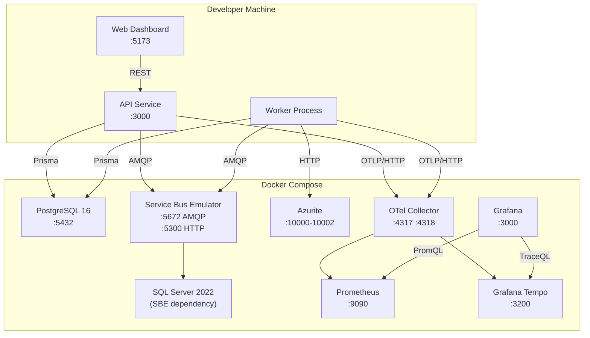
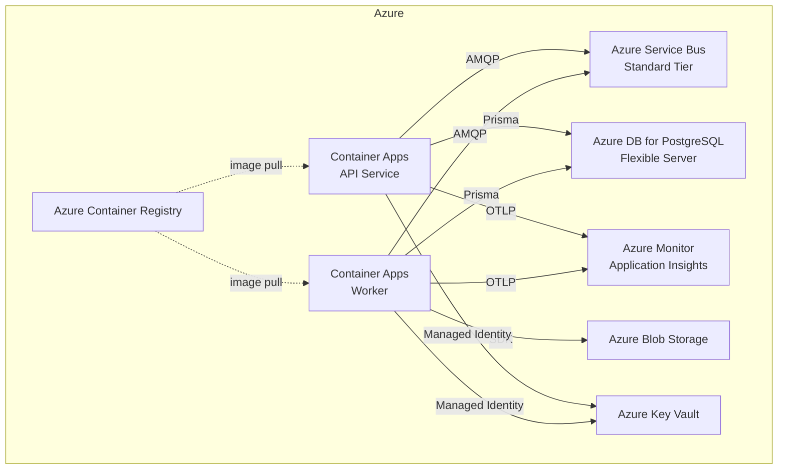

# Agent Flight Recorder — Design

## System Context



## Container Architecture



## Execution Sequence — Happy Path



## Execution Sequence — Retry Path



## Execution Sequence — Dead-Letter Path



## Replay Sequence



## Domain Model



## Execution State Machine



## Package Structure

```
agent-flight-recorder/
├── apps/
│   ├── api/                    # Fastify REST API
│   │   ├── src/
│   │   │   ├── routes/         # Route handlers (one file per resource)
│   │   │   ├── plugins/        # Fastify plugins (auth, error handler, OTel)
│   │   │   ├── middleware/     # Request ID, correlation headers
│   │   │   └── server.ts       # App entry point
│   │   ├── package.json
│   │   └── tsconfig.json
│   ├── worker/                 # Execution worker
│   │   ├── src/
│   │   │   ├── handlers/       # Message handlers
│   │   │   ├── engine/         # Execution engine (state machine driver)
│   │   │   └── worker.ts       # Entry point
│   │   ├── package.json
│   │   └── tsconfig.json
│   └── web/                    # React dashboard
│       ├── src/
│       │   ├── pages/          # Overview, Executions, Detail, DeadLetter, DemoLab
│       │   ├── components/     # Shared UI components
│       │   ├── hooks/          # Data-fetching hooks
│       │   └── api/            # API client
│       ├── package.json
│       └── tsconfig.json
├── packages/
│   ├── domain/                 # Zero-dependency core types
│   │   ├── src/
│   │   │   ├── execution.ts    # Execution type + status enum
│   │   │   ├── state-machine.ts # Transition logic
│   │   │   ├── events.ts       # Event schemas + types
│   │   │   ├── budget.ts       # BudgetPolicy + enforcement logic
│   │   │   ├── messaging.ts    # MessageBus interface
│   │   │   ├── providers.ts    # ExecutionProvider interface
│   │   │   ├── storage.ts      # ArtifactStore interface
│   │   │   └── errors.ts       # Typed domain errors
│   │   └── package.json
│   ├── providers/              # Provider implementations
│   │   ├── src/
│   │   │   ├── mock/           # MockProvider + failure injection
│   │   │   └── sapiom/         # SapiomProvider wrapping @sapiom/tools
│   │   └── package.json
│   └── observability/          # OTel setup + logger
│       ├── src/
│       │   ├── tracer.ts       # OTel SDK init
│       │   ├── metrics.ts      # Metric definitions
│       │   └── logger.ts       # Structured JSON logger
│       └── package.json
├── infra/
│   ├── local/
│   │   ├── docker-compose.yml
│   │   ├── servicebus-config.json
│   │   ├── otel-collector-config.yaml
│   │   ├── prometheus.yml
│   │   └── grafana/
│   │       ├── dashboards/
│   │       └── datasources/
│   └── azure/
│       ├── main.bicep
│       └── modules/
├── docs/
│   ├── adr/
│   ├── integrations/
│   │   └── sapiom.md
│   ├── architecture.md
│   ├── reliability.md
│   ├── replay.md
│   ├── cost-controls.md
│   ├── observability.md
│   ├── security.md
│   ├── local-development.md
│   └── azure-deployment.md
├── scripts/
│   ├── demo.sh
│   ├── seed.ts
│   └── azure/
│       ├── estimate-or-explain-cost.sh
│       └── destroy.sh
├── .github/
│   └── workflows/
│       ├── ci.yml
│       └── deploy-azure.yml      # Manually triggered only
├── .kiro/
├── docker-compose.yml            # Symlink or re-export of infra/local/docker-compose.yml
├── Makefile
├── pnpm-workspace.yaml
├── package.json
├── .env.example
├── .gitignore
├── README.md
└── LICENSE
```

## API Endpoint Summary

| Method | Path | Description |
|--------|------|-------------|
| POST | `/api/v1/executions` | Create execution |
| GET | `/api/v1/executions` | List executions (paginated, filtered) |
| GET | `/api/v1/executions/:id` | Get execution detail |
| GET | `/api/v1/executions/:id/events` | Get execution event log |
| GET | `/api/v1/executions/:id/cost` | Get execution cost breakdown |
| GET | `/api/v1/executions/:id/artifacts` | List execution artifacts |
| GET | `/api/v1/executions/:id/trace` | Get trace correlation IDs |
| POST | `/api/v1/executions/:id/cancel` | Cancel execution |
| POST | `/api/v1/executions/:id/retry` | Manual retry (re-enqueue) |
| POST | `/api/v1/executions/:id/replay` | Replay execution (input or simulation) |
| GET | `/api/v1/dead-letter` | List dead-lettered executions |
| GET | `/api/v1/dead-letter/:id` | Get dead-letter detail |
| POST | `/api/v1/dead-letter/:id/requeue` | Requeue dead-lettered execution |
| GET | `/api/v1/health` | Health check |
| GET | `/api/v1/ready` | Readiness check |
| GET | `/metrics` | Prometheus metrics |

## Local Development Architecture



## Optional Azure Deployment Architecture



*Deployment requires `ALLOW_AZURE_DEPLOY=true`. See `docs/azure-deployment.md`.*
