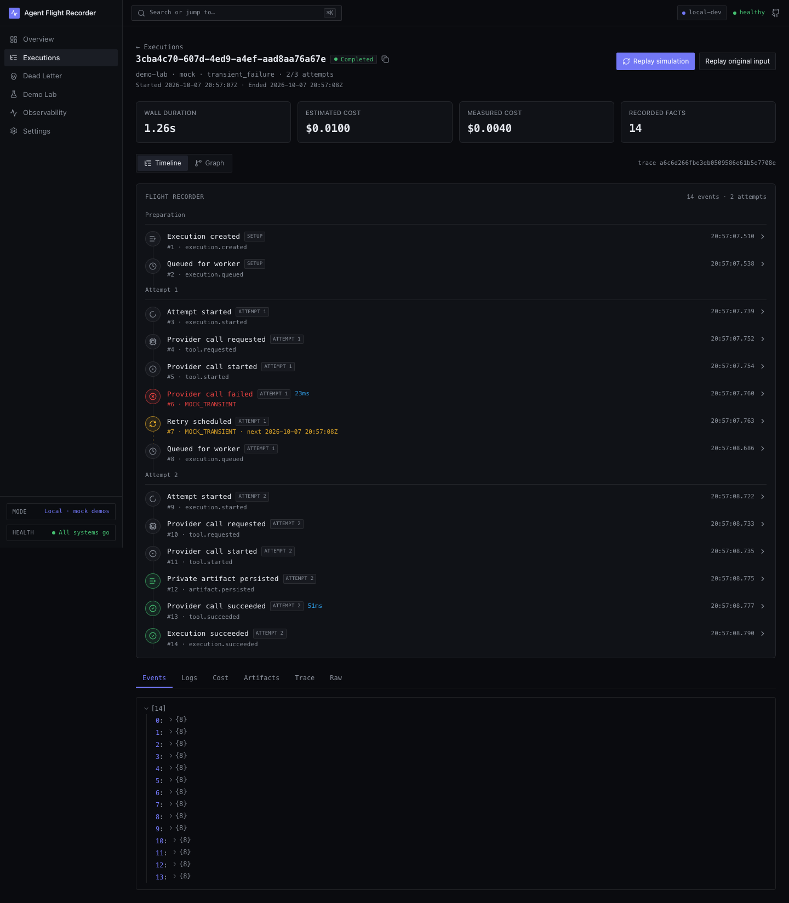
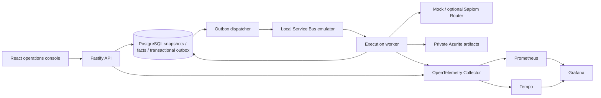
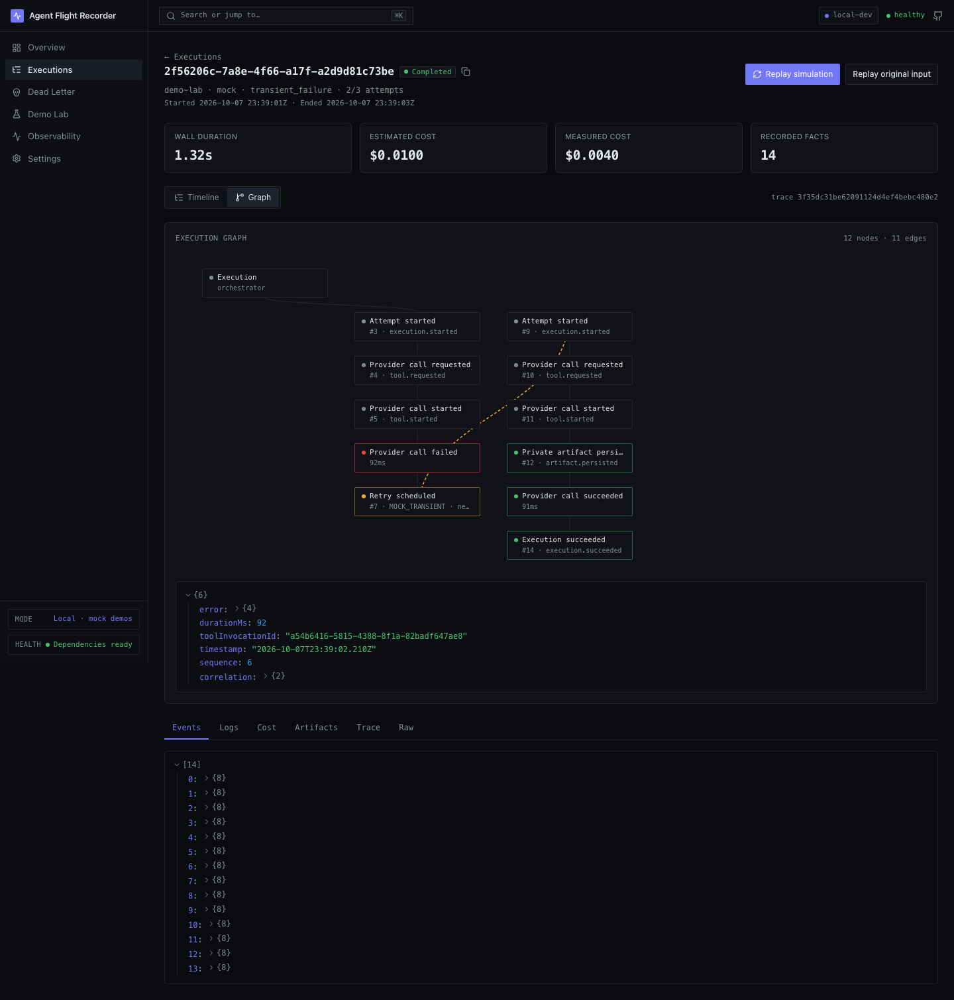

# Agent Flight Recorder

**[Live Azure demo](https://agent-recorder-demo.canadacentral.cloudapp.azure.com) · [GitHub repository](https://github.com/PeterYousefi/agent-flight-recorder) · [Download source ZIP](https://github.com/PeterYousefi/agent-flight-recorder/archive/refs/heads/main.zip)**

**Observable, replayable, cost-aware AI agent infrastructure.**

[](https://github.com/PeterYousefi/agent-flight-recorder/actions/workflows/ci.yml) [](https://github.com/PeterYousefi/agent-flight-recorder/actions/workflows/security.yml) [](https://github.com/PeterYousefi/agent-flight-recorder/actions/workflows/local-acceptance.yml) [Apache 2.0](LICENSE)



An asynchronous agent invocation can fail after being queued, consume money before timing out, or execute again after a worker crashes. AFR records the decisions and results needed to investigate that work: durable state, ordered events, attempts, cost records, private artifacts and a trace across the queue boundary.

This is a working control plane with a hosted Azure demo, local development, a deterministic demo provider and an optional, narrowly scoped Sapiom Router adapter. The console reads real PostgreSQL projections. Synthetic demo costs are labelled; unavailable external prices and queue depth remain unavailable.

## Try it online

Open [the Azure demo](https://agent-recorder-demo.canadacentral.cloudapp.azure.com) in your browser—no installation or paid AI key is needed. Start with **Demo Lab → Transient Failure**, inspect the timeline and graph, then try **Replay**.

The hosted demo runs on Azure in Canada Central and uses real PostgreSQL, Service Bus and private Blob Storage. Provider output and application cost figures are simulated. It is a shared demo: visitors can inspect and control one another's synthetic executions. [Hosting, costs and deletion instructions](docs/vm-azure-demo.md).

## Run the complete demo locally

Prerequisites: Node.js 22+, pnpm 9.15.9 and running Docker Desktop/Compose. Allow Docker enough memory for PostgreSQL, the Service Bus emulator's SQL sidecar and the observability stack. Apple Silicon runs the emulator's SQL sidecar under amd64 emulation.

```sh
git clone https://github.com/PeterYousefi/agent-flight-recorder.git
cd agent-flight-recorder
pnpm install --frozen-lockfile
pnpm demo
```

Open [the console](http://localhost:5173), select **Demo Lab → Transient Failure**, and watch attempt one fail and attempt two succeed. Switch **Timeline → Graph**, select a node, inspect **Artifacts**, then open **Trace**. Try **Replay**: it creates a linked execution while preserving the original history. Try **Dead Letter** and **Requeue** to inspect the same invariant for exhausted work.

`pnpm demo` starts Docker services, builds the workspace, applies committed migrations and starts API, worker and frontend. It explicitly disables Sapiom and removes its key from child processes. No `.env` or cloud account is required. Warm startup is a few minutes; first image downloads and platform emulation can take longer. Ctrl+C stops the launcher's processes; containers and persistent data remain available. `docker compose --profile observability down` stops containers without deleting volumes.

API: [localhost:3000/api/docs](http://localhost:3000/api/docs). Grafana: [localhost:3001](http://localhost:3001), local-only `admin` / `admin`. Prometheus: [localhost:9090](http://localhost:9090). The application API and all container ports bind to loopback.

**Optional hosted demo: Azure VM, PostgreSQL, Service Bus and private Blob Storage. Local startup creates no Azure resources.**

**Azure cost for local development/demo: $0**

## Architecture

The diagram shows local development with emulators. The hosted demo uses Azure Service Bus and Blob Storage, managed PostgreSQL, and one VM for the API, embedded logical worker and observability stack.



TypeScript/pnpm monorepo: `apps/web` uses React, Vite, TanStack Router/Query and the migrated Lovable design. `apps/api` and `apps/worker` share application services and validated runtime wiring. `packages/domain` has no I/O; infrastructure adapters implement its ports. Prisma migrations and repositories stay in `packages/persistence`. The former Lovable export was removed after the migration passed browser and build checks.

## What is implemented

| Capability               | Behavior                                                                                                                                                     |
| ------------------------ | ------------------------------------------------------------------------------------------------------------------------------------------------------------ |
| Durable creation         | Canonical request fingerprint plus database uniqueness prevents concurrent duplicate creation; conflicting reuse returns an error.                           |
| At-least-once processing | Transactional outbox and fenced attempt leases protect local history from duplicate delivery and stale results. External effects can still repeat.           |
| Retries                  | Bounded exponential backoff with jitter, provider retry hints, deadlines and persisted attempt history.                                                      |
| Dead letters             | Terminal failure facts and historical records; requeue creates a new linked execution.                                                                       |
| Replay                   | Input replay retains provider/input; simulation replay forces MockProvider. Both create new history and an audit relationship.                               |
| Cancellation             | Durable terminal state, provider abort signal and rejection of late state transitions; remote cancellation is best effort.                                   |
| Budgets                  | Exact integer micro-dollar accounting, estimated-cost admission, warnings and duration/attempt/tool-call limits. Unknown external prices are never invented. |
| Artifacts                | Private blobs, opaque keys, owner validation, checksum verification and a 1 MiB size limit.                                                                  |
| Observability            | HTTP → outbox/queue → worker → provider/artifact trace propagation, committed-result metrics and sanitized structured logging.                               |
| Operations console       | Overview, executions, immutable dead letters, ten Demo Lab scenarios, observability and safe configuration status. Keyboard navigation and mobile layout.    |



## Sapiom integration

The [verified integration](docs/integrations/sapiom.md) uses `POST https://router.sapiom.ai/v1/chat/completions` with Bearer authentication from `SAPIOM_API_KEY`, non-streaming requests and `x-sapiom-lane: run_now`. `SAPIOM_ENABLED=false` is the default. Explicit Sapiom requests fail if unavailable; they never silently turn into mock work.

Normal tests inject mocked HTTP. The separate live test requires `RUN_SAPIOM_INTEGRATION_TESTS=true`, `SAPIOM_ENABLED=true`, a key and a model. **No live Sapiom test was run for this release.** This adapter does not implement the broader capability SDK or invent per-call prices, remote cancellation, or external idempotency guarantees.

## Validation and security

Local release checks cover **127 unit tests, 49 PostgreSQL integration tests, 7 API integration tests, 7 emulator integration tests and 5 browser tests**. The browser checks create actual executions and inspect retry history, graph nodes, private artifacts, immutable replay/requeue, cancellation, keyboard focus and mobile navigation. See [acceptance evidence](docs/acceptance.md).

Format, lint, strict typecheck and workspace build are release gates. CI runs these checks and database tests; separate workflows scan full Git history/source and dependencies, and exercise Docker emulators plus the console. No workflow deploys Azure or invokes paid providers.

[Security controls](docs/security.md) include localhost Host/Origin checks, safe response headers, bounded bodies/artifacts, input validation and credential-free logs/traces. Gitleaks scans history and non-ignored source. Dependabot proposes updates for review. Dependency audit results and any exceptions are recorded in the security document.

```sh
pnpm format:check
pnpm lint
pnpm typecheck
pnpm test
pnpm build
# Install Gitleaks first and put it on PATH:
pnpm security:secrets
pnpm security:audit
# With the complete demo running:
node scripts/local/verify-demo.mjs
pnpm --filter @afr/web exec playwright test
pnpm benchmark
```

## Benchmarks

[Reproducible local results](docs/benchmarks.md) measure HTTP list/create/history latency, scheduling, queue-to-worker delay and terminal throughput using actual emulator work. `pnpm benchmark` leaves its executions inspectable and writes an ignored local report. Small samples on one development machine are evidence of a functioning path, not production capacity claims. Creation timing includes transactional snapshot/event/outbox writes; it does not isolate event persistence overhead.

## Engineering decisions and limits

The [ADRs](docs/adr) explain TypeScript, event-driven execution, infrastructure ports, PostgreSQL, local Azure emulation, OpenTelemetry and replay. [Reliability](docs/reliability.md) distinguishes durable local idempotency from repeated external effects, explains lease recovery and discusses private-blob orphan cleanup.

The default local runtime must remain on localhost. The separate public mode exposes only a shared synthetic demo, with paid providers disabled, bounded creation, rate limits, exact Host/Origin checks and HTTPS. It has no multi-user authentication or tenant isolation; use it for demonstrations, not private or production workloads. Queue depth is unavailable through the emulator's SDK management surface. Settings report dependency health rather than proving worker liveness. Dollar limits cannot preflight unknown-priced Sapiom calls or guarantee a remote billing cap. Grafana/Tempo have finite local retention. The dashboard polls and bounds event loading at 5,000 facts. The optional Azure deployment includes cloud runtime wiring, managed identity roles, PostgreSQL, private artifacts, native VM packaging and a monthly project budget alert. Budget alerts do not enforce a spending cap. Authenticated production deployment still requires additional work.

Next improvements: authenticated tenant-scoped APIs and artifacts; a provider deduplication/usage-pricing contract plus crash/orphan reconciliation; production load/fault testing and authenticated cloud operation.

## Documentation

- [Architecture](docs/architecture.md), [persistence](docs/persistence.md), [event model](docs/event-model.md)
- [Reliability](docs/reliability.md), [retries](docs/retries.md), [replay](docs/replay.md), [dead letters](docs/dead-letters.md)
- [Budgets](docs/budgets.md), [artifacts](docs/artifacts.md), [Sapiom](docs/integrations/sapiom.md)
- [Observability](docs/observability.md), [operations](docs/operations.md), [Demo Lab](docs/demo.md)
- [Hosted Azure demo, costs and deletion](docs/vm-azure-demo.md)
- [Local development](docs/local-development.md), [security](docs/security.md), [Azure architecture and opt-in policy](docs/azure-deployment.md)
- [Benchmarks](docs/benchmarks.md), [acceptance evidence](docs/acceptance.md)
