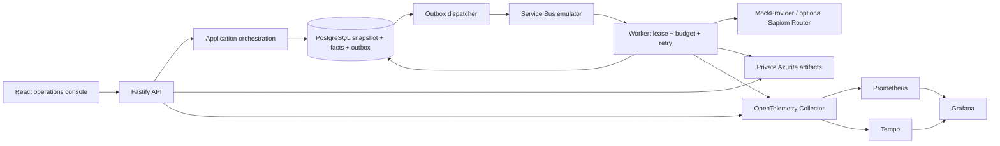

# Architecture

Agent Flight Recorder separates deterministic domain rules, application use cases and I/O adapters. React/Vite reads a Fastify API; a durable PostgreSQL outbox publishes envelopes to a local Service Bus queue; an independently running worker executes a provider and persists ordered facts/costs/artifact metadata. Private Azurite holds artifact content. PostgreSQL is the source of truth; OTel telemetry is best-effort.

Domain has no Prisma, Azure SDK, HTTP or telemetry dependencies. It owns execution/attempt states, event contracts/schema versions, budget admission, exact micro-dollar arithmetic, provider/transport/artifact/persistence ports, and duplicate decisions. Application composes create/cancel/retry/dead-letter/replay use cases and normalizes provider outcomes. Persistence enforces locking, uniqueness, event sequence and transaction rollback. Runtime owns process composition and local configuration; SDKs stay in adapters.

Snapshot state and immutable facts serve different needs. Read models aggregate persisted data independently of browser pagination. A successful execution can have estimated and measured costs from multiple attempts; unknown pricing remains null. Replay/requeue links connect new execution IDs without editing the terminal source. Cancellation is logical and cannot recall a billable remote request already in flight.

Outbox publication is at least once. A crash after publish/before marking can duplicate a delivery; the worker's attempt lease and stale/final checks fence those deliveries. External provider invocation and blob upload are not an atomic PostgreSQL transaction. See [reliability](reliability.md) for limits and [ADRs](adr/) for decisions.
